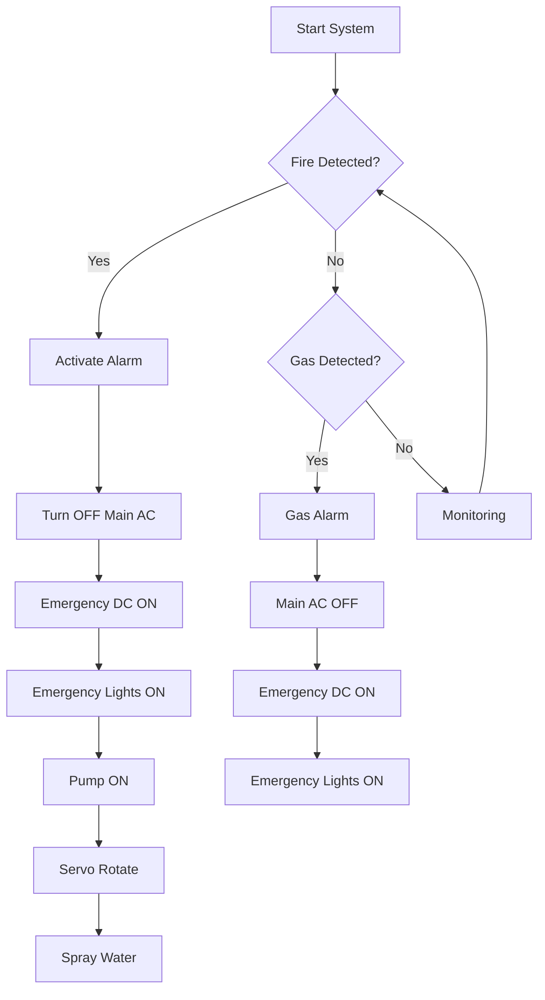

<div align="center">

# 🔥🚒 Arduino Smart Fire Extinguishing & Gas Detection System

### Intelligent Fire Protection System using Arduino UNO


### 🔥 Automatic Fire Detection, Fire Suppression & LPG Gas Safety System

**Developed by:** **Tanvir Hussain**  
**Year:** **2025**

---

</div>

# 📖 Overview

The **Arduino Smart Fire Extinguishing System** is an intelligent embedded safety project designed to automatically detect fire and flammable gas leakage while taking immediate protective actions without human intervention.

The system utilizes:

- 🔥 Three Flame Sensors for 360° fire detection
- ⛽ MQ-6 Gas Sensor for LPG & Butane leakage detection
- 💧 Water Pump controlled by Relay
- 🔄 Servo Motor for automatic water spraying
- 🚨 Fire & Gas Alarm
- 💡 Emergency DC Lighting
- ⚡ Automatic Main AC Power Shutdown

The project improves safety in homes, laboratories, warehouses and industrial environments.

---

# ✨ Features

## 🔥 Fire Detection

- ✅ Detects fire from three different directions
- ✅ Automatic water pump activation
- ✅ Servo motor sweeps water across fire area
- ✅ Fire alarm activation
- ✅ LED indication
- ✅ Turns OFF Main AC Electricity
- ✅ Switches ON Emergency DC Power
- ✅ Turns ON Emergency Lights

---

## ⛽ Gas Leakage Detection

Supports detection of:

- LPG
- Butane
- Other flammable gases

When gas is detected:

- 🚨 Gas safety alarm activates
- ⚡ Main AC power turns OFF
- 🔋 Emergency DC power turns ON
- 💡 Emergency lights activate
- ❌ Water pump remains OFF
- ❌ Servo remains OFF

---

# 🛠 Components Used

| Component | Quantity |
|------------|---------:|
| Arduino UNO | 1 |
| Flame Sensor | 3 |
| MQ-6 Gas Sensor | 1 |
| Relay Module | 1 |
| Servo Motor | 1 |
| DC Water Pump | 1 |
| Buzzer / Alarm | 1 |
| Indicator LEDs | Multiple |
| Emergency DC Lights | 1 Set |
| Main AC Relay | 1 |
| Power Supply | 1 |

---

# ⚙ System Architecture

```text
                    +----------------------+
                    |    Arduino UNO       |
                    +----------+-----------+
                               |
      ---------------------------------------------------------
      |            |              |               |            |
 Flame Sensor1 Flame Sensor2 Flame Sensor3     MQ6 Gas      Relay
                                                Sensor         |
                                                              Pump
                                                               |
                                                          Water Spray
                                                               |
                                                            Servo Motor

                               |
                               |
                      Alarm / Buzzer
                               |
                         LED Indicators
                               |
                   Main AC Power Relay Control
                               |
              Emergency DC Power & Emergency Lights
```

---

# 📡 Working Principle

## 🔥 Fire Detection Workflow

```text
Fire Detected
      │
      ▼
Any Flame Sensor Triggered
      │
      ▼
Arduino Receives Signal
      │
      ├────────► Fire Alarm ON
      │
      ├────────► LED Indicator ON
      │
      ├────────► Main AC OFF
      │
      ├────────► Emergency DC ON
      │
      ├────────► Emergency Lights ON
      │
      ├────────► Relay ON
      │
      ▼
Water Pump Starts
      │
      ▼
Servo Rotates
      │
      ▼
Water Sprays Across Fire
```

---

## ⛽ Gas Detection Workflow

```text
Gas Leakage Detected
        │
        ▼
MQ-6 Sensor Triggered
        │
        ▼
Arduino
        │
        ├────► Safety Alarm
        ├────► Main AC OFF
        ├────► Emergency DC ON
        └────► Emergency Lights ON
```

---

# 📊 System Logic

| Event | Pump | Servo | Alarm | Main AC | Emergency DC | Emergency Lights |
|--------|------|--------|--------|---------|---------------|-----------------|
| Normal | ❌ | ❌ | ❌ | ✅ | ❌ | ❌ |
| Fire | ✅ | ✅ | 🚨 | ❌ | ✅ | ✅ |
| Gas Leak | ❌ | ❌ | 🚨 | ❌ | ✅ | ✅ |

---

# 🔌 Pin Configuration

| Arduino Pin | Device |
|--------------|--------|
| D2 | Flame Sensor 1 |
| D3 | Flame Sensor 2 |
| D4 | Flame Sensor 3 |
| A0 | MQ-6 Gas Sensor |
| D5 | Relay Module |
| D6 | Servo Motor |
| D7 | Alarm/Buzzer |
| D8 | Fire Indicator LED |
| D9 | Emergency Light Relay |
| D10 | Main AC Relay |

> Pin numbers may be modified according to the circuit design.

---

# 📈 Operating Modes

| Mode | Description |
|------|-------------|
| 🟢 Normal | System continuously monitors fire and gas. |
| 🔥 Fire Mode | Activates extinguishing mechanism and emergency safety system. |
| ⛽ Gas Mode | Isolates electrical power and warns occupants. |

---

# 🧠 Decision Flow



---

# 📊 Functional Diagram

```text
               FIRE
                 │
                 ▼
         Flame Sensors (3)
                 │
                 ▼
            Arduino UNO
                 │
      ┌──────────┼───────────┐
      │          │           │
      ▼          ▼           ▼
   Relay      Alarm      Main Relay
      │                      │
      ▼                      ▼
 Water Pump             AC Power OFF
      │
      ▼
 Servo Motor
      │
      ▼
 Water Spray


              GAS LEAK
                 │
                 ▼
            MQ-6 Sensor
                 │
                 ▼
            Arduino UNO
                 │
      ┌──────────┴──────────┐
      ▼                     ▼
 Emergency Lights       Gas Alarm
```

---

# 🎯 Applications

🏠 Smart Homes

🏫 Schools

🏭 Industries

🧪 Laboratories

🏢 Offices

📦 Warehouses

🚗 Garages

⛽ Fuel Storage Areas

---

# 🚀 Future Improvements

- 📱 IoT Monitoring
- 📡 GSM SMS Alerts
- ☁ Cloud Dashboard
- 📷 Camera Integration
- 📍 GPS Notification
- 🌐 Mobile Application
- 📶 Wi-Fi Monitoring
- 🔋 Battery Health Monitoring
- 📈 Data Logging

---

# 🧪 Testing Summary

| Test | Result |
|------|--------|
| Flame Detection | ✅ Passed |
| Water Pump Control | ✅ Passed |
| Servo Rotation | ✅ Passed |
| Fire Alarm | ✅ Passed |
| MQ-6 Gas Detection | ✅ Passed |
| Main AC Shutdown | ✅ Passed |
| Emergency DC Switching | ✅ Passed |
| Emergency Lights | ✅ Passed |

---

# 📸 Project Preview

```
          🔥
      Flame Sensor
           │
           ▼
    ┌─────────────┐
    │ Arduino UNO │
    └─────────────┘
      │   │    │
      │   │    └────────► Alarm
      │   │
      │   └─────────────► Servo
      │
      └──────────────► Relay
                         │
                         ▼
                    Water Pump

MQ-6 Sensor ─────────────► Arduino

Arduino ───────────────► Main AC OFF

Arduino ───────────────► Emergency Lights ON
```

---

# 👨‍💻 Developer

## **Tanvir Hussain**

Embedded Systems Developer

📅 **Project Year:** **2025**

---

# 📜 Project

This project is developed by Tanvir Hussain for his school exhibition in the year 2025.

---

<div align="center">

## ⭐ If you like this project, don't forget to give it a Star ⭐

**Made with ❤️ using Arduino**

🔥 **Stay Safe • Detect Early • Respond Automatically** 🚒

</div>
